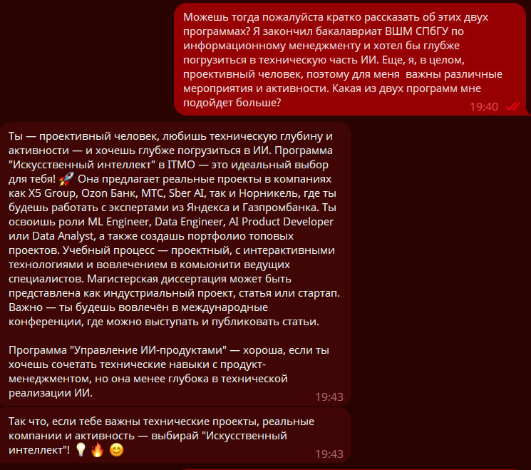
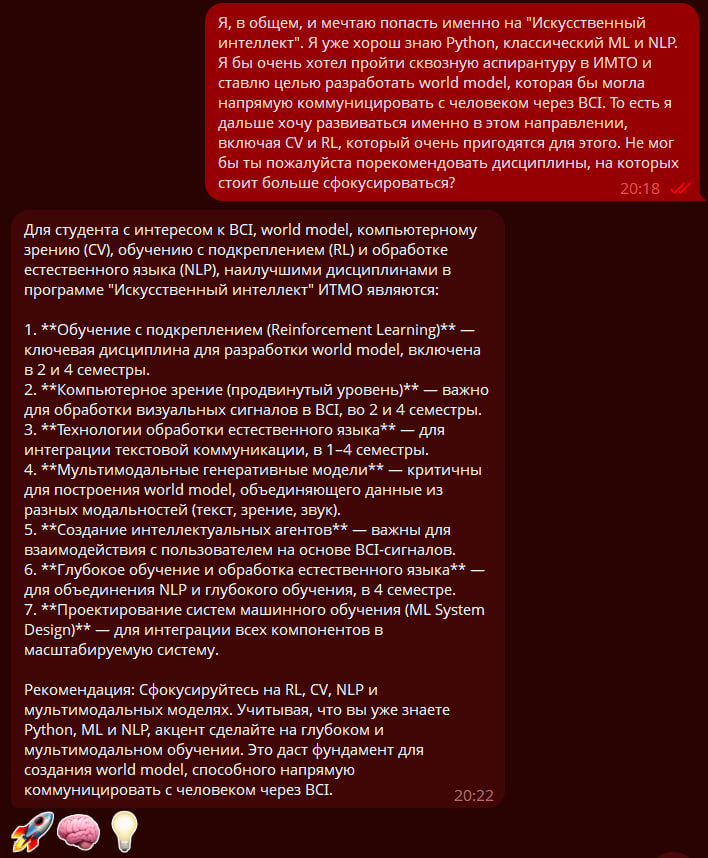
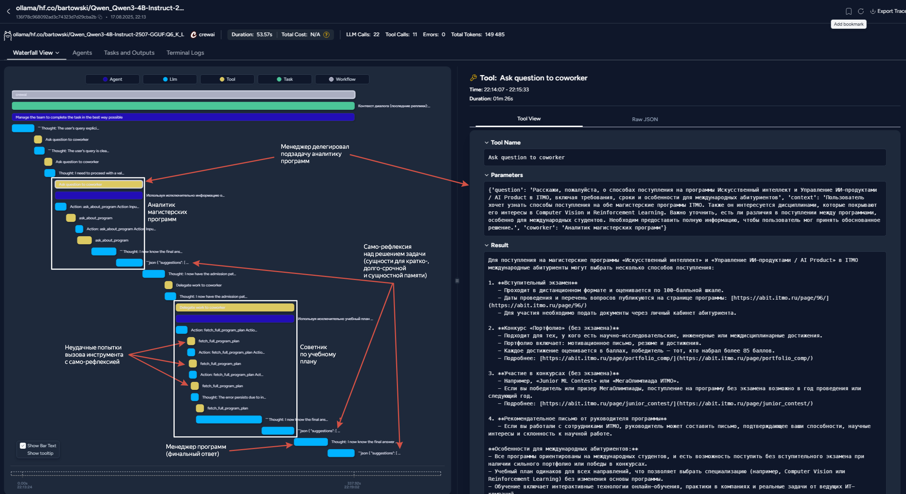
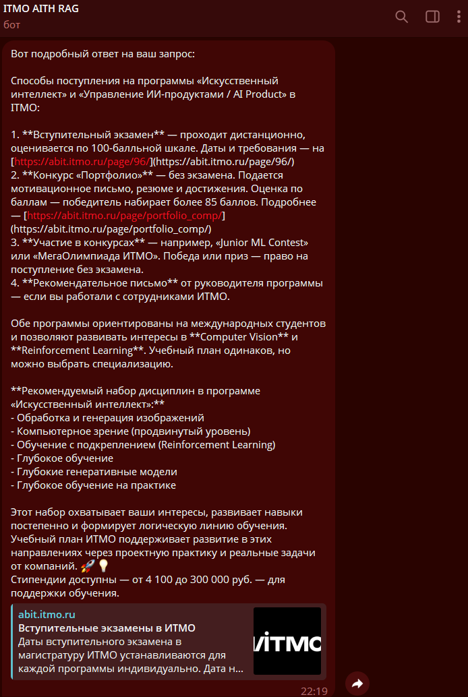

### 👀 Overview

В директории QA представлен Question-Answering телеграм-бот, который
ориентирует пользователя и предлагает ему наиболее подходящую программу
и дисциплины. Для этого бот пользуется информацией с сайтов программ
"Искусственный интеллект" и "Управление ИИ-продуктами/AI Product",
а также pdf-файлами программ с перечнем дисциплин.

Чтобы запустить агента, достаточно получить Telegram-токен для доступа
к интерфейсу ввода, а также AgentOps-токен, для мониторинга взаимодействия
агентов и прогресса выполнения задач.

Разработанная сстема является наивным прототипом QA-мультиагентной системы, которая состоит из четырех агентов:
 *  **Оркестратор** — агент-менеджер, к которому попадает запрос пользователя. Он руководит всей командой, формулирую задачи для основных агентов;
 *  **Аналитик магистерских программ** — агент, специализирующийся сугубо на обзоре программ (общее описание, способы поступления, преимущества, возможности и т.д.), то есть содержании веб-страниц программ.
 *  **Советник по учебному плану** — агент, специализирующийся исключительно на работе с учебными планами, включая персонализированные рекомендации дисциплин, общей информации о кредитах, часах, блоках и др.
 *  **Менеджер программ ИТМО** — агент, имитирующий менеджера-программы, задачей которого является суммаризация и персонализация полученных от других агентов результатов, также он ответственен за оформление и тон ответа.

Мультиагентная система разрабатывал на новом прогрессивном фреймворке `CrewAI`. В качестве эмбеддинговой модели использовалась `Qwen3-Embedding-0.6B-GGUF:Q8_0`, которая оптимальна по размеру и производительности. Базовой LLM является `Qwen3-4B-Instruct-2507-GGUF:Q6_K_L` — квантованная версия недвано вышедшей обновленной `Qwen3-4B`. Модели подбирались из того условия, чтобы была вохможность развернуть их на минимальном оборудовании, то есть с видеокартной на 6GB VRAM.

Сама система предназначена для локального использования через `docker-compose` и представляет собой 4 микросервиса:
 - `ollama_embed` — отдельный контейнер для эмбеддинговой модели;
 - `ollama_gen` — контейнер для генеративной модели (LLM);
 - `rag` — непосредственно сама RAG-система, включающая API на `FastAPI`, `ChromaDB` для хранения эмбеддингов, команду агентов, а также инициализатор, состоящий из парсера и наполнителя векторной БД;
 - `telegra-bot` — простейший интерфейс для Telegram-бота, написанный на `aiogram`;

Такая архитектура была разработана для повышения отказоустойчивости и поративности системы.

Стоит подчеркнуть как устроен парсер:

1. Сначала просиходит парсинг с приведенных в условиях задачи веб-страниц (через `requests`, так как страницы всего две);
2. Затем происходит конвертация из `html` в `markdown` формат при помощи библиотек `trafilatura` и `markdownify` (самый надежный и стабильный пайплайн);
3. PDF-файлы обрабатываются отдельно:
   * Так как учебный план имеет трудный для парсинга формат (таблица в PDF), используется библиотека `camelot`, которая при помощи OCR разбирает табличный PDF-файл в список страниц в формате `pandas.DataFrame`;
   * Далее конкатенированный `pandas.DataFrame` структурирется по блокам и подмодулям, после чего форматируется в строковой формат
4. После всех действий в директорию `data/` помещаются 4 текстовых файлов
5. Наконец, сохраненые файлы переносятся в `ChromaDB`, с метаданными о том, к какой программе они принадлежат и являются ли они учебным планом или нет.

### ⚙️ Requirements
Запуск агента требует наличия около 6Гб общей памяти на устройстве
и около 5Гб VRAM. Тем не менее, если памяти недостаточно можно
воспользоваться версиями моделей меньшего порядка квантования (например, `Q4_K_M`)
же взять не 4B, а любую дргую модель мешьнего размера (например,
`hf.co/bartowski/Qwen_Qwen3-1.6B-Instruct-2507-GGUF`).

Сама QA-мультиагентная сстема запускается одной командой:

```bash
docker compose -f 'qa/docker-compose.yml' up -d --build
```

### 🌟 Features

1. <details open>
   <summary><b>Оптимизация инференса</b></summary>

   Для оптимизации инференса на больших контекстах используются:

      * FlashAttention;
      * Квантование KV-кэша (`q4_0`);
      * Механизм параллелизации, то есть батчевой обработки;
      * Выгрузка 6 слоев на CPU (чтобы минимизировать вероятность выгрузки KV-кэша, что кратно замедляет throughput).

    При желании, Вы можете изменить любые настройки в файле `docker-compose`
    и собственном .env (скопированном от `.env.example`).

    Параметры `top_p` и `top_k` были выбраны ориентируясь на рекомендации разработчиков
    `Qwen3`. `Temperature` и `presemce_penalty` были подобраны из личного опыта
    и адаптированы под взаимодействие именно на русском языке.
</details>

2. <details open>
   <summary><b>Работа с контекстом</b></summary>

    Несмотря на то, что в `CrewAI` изначально не предусмотрены механизмы работы с контекстом в режиме чата,
    был реализован наивный механизм обработки предыдущего контекста:

    1. Внутри контейнера агентной системы, каждое поступающее от пользователя сообщение сохраняется локально
    2. На системном уровне подготавливается переменная `user_query`, которая состоит из последних 18,000  символов (запросы пользователя и ответы агента)
    3. На вход команде поступает отформатированная строковая переменная `user_query`
    4. После того, как агент сгенерировал ответ, его сообщени так же сохраняется локально

    Такой механизм несколько похож на довольно привычный `ConversationBufferWindowMemory` из `langchain`,
    но отличается тем, что оперирует символами, а не интентами.

</details>

3. <details open>
    <summary><b>Работа с памятью (Self-Reflection)</b></summary>

    Мультиагентная система реализует механизм работы с память и частично Self-Reflection. Память сегментирована на 3 отдельные части:

     * **Краткосрочная** (`ChromaDB`) — временно сохраняет последние взаимодействия и результаты с помощью RAG, позволяя агентам запоминать и использовать информацию, относящуюся к их текущему контексту, во время текущих операций
     * **Долгосрочная** (`SQLite3`) — сохраняет ценную информацию и опыт, полученные в ходе предыдущих активаций агентов, позволяя каждому из агентов накапливать и совершенствовать свои знания с течением времени.
     * **Сущностная** (`ChromaDB`) — собирает и систематизирует информацию о сущностях (программах, компаниях, концепциях), с которыми приходится сталкиваться в ходе выполнения задач, способствуя более глубокому пониманию и сопоставлению взаимосвязей. Использует RAG для хранения информации о сущностях.

    Суть в том, что при каждом вызове агента после получения результатов проиходит саморефлексия, так и наполняются различные сегменты памяти. Аналогично, при каждой активации агента, ему в промпт инкапсулируются наиболее релевантные прежде полученные знания.
</details>

4. <details open>
   <summary><b>RAG (Retrieval-Augmented Generation)</b></summary>

    Для реализации RAG я использовал `embedchain` как удобную обертку для фильтрации и поиска наиболее  релевантного текста в `ChromaDB` при помощи эмбеддинговой модели `Qwen3-Embedding-0.6B-GGUF:Q8_0`. Эта  реализация крайне проста и лаконична, так как мы можем тонко настраивать механизм чанкинга, эмбддинговую  модель, векторную БД и сам процесс извлечения релевантных текстов (включая фильтрацию, цитирование и многое другое, что так же было реализовано).
</details>

### 🚀 Examples

### 💬 Chat

<p align="center">
  <table>
    <tr>
      <td align="center">
        
        <br>
        <b>Приветствие и ответ<br>на неспециализированный вопрос</b>
      </td>
      <td align="center">
        
        <br>
        <b>Персонализированный обзор программ</b>
      </td>
      <td align="center">
        
        <br>
        <b>Рекомендации по учбному плану<br>с фокусом на бэкграунд</b>
      </td>
    </tr>
  </table>
</p>

### 🔍 Observability

Благодаря встроенному мониторингу мы можем погрузиться в детали работы мультиагентной системы:

#### **Запрос**:

Расскажи пожалуйста о способах поступления на обе программы, а затем предложи небольшой набор дисциплин по программе ИИ, который бы покрывал мои предпочтения в дальнейшем развитии в сфере Computer Vision и Reinforcement learning

<p align="center">
<td align="center">
<b>Панель мониторинга AgentOps</b>
<br>

</td>
</p>

<p align="center">
<td align="center">
<b>Ответ мультиагентной системы</b>
<br>

</td>
</p>

#### **Пояснения**:

Вопрос был довольно сложен, но агенты справились отлично (за исключением форматирования). Вот некоторые сложности и подвохи:
- У обеих программ одинаковые способы поступления. Система просмотрела каждый и дала правильный **единый** ответ для обеих программ;
- Система поняла, что под "ИИ" подразумевается тьолько программа "Искуственный Интеллект" и дала корректный и **персонализированный** ответ.